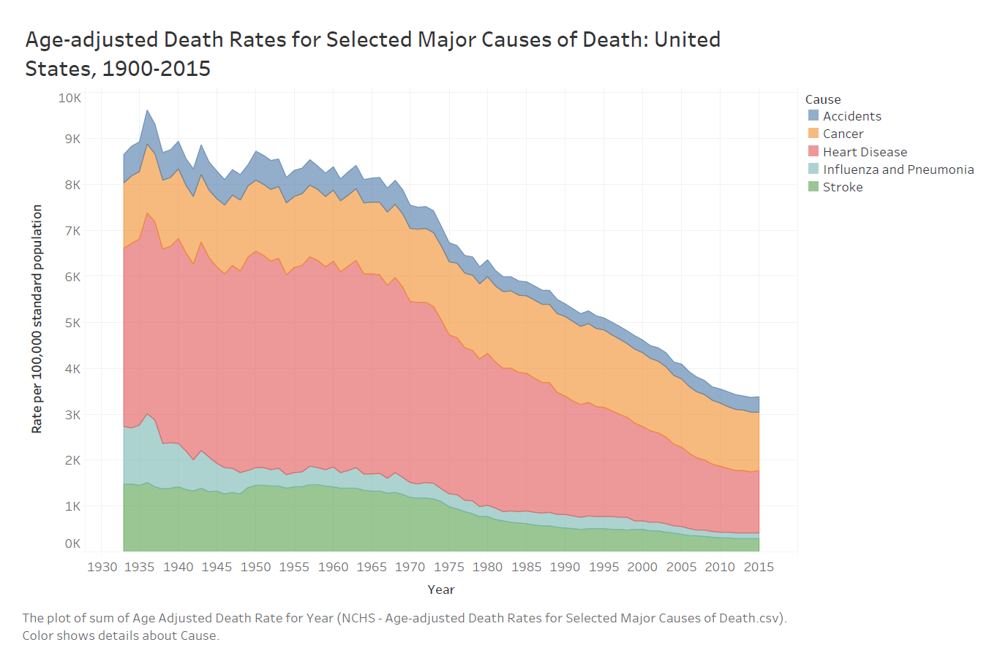

The graphic of U.S. mortality trends since 1900 highlight the differences in age-adjusted death rates for five selected major causes of death.
----

## Original Visualization

## Revised Data Visualization

- My Wireframe:The original data visualization uses line chart as its data visualization type, which is to show the trend very clearly but hard for audience to intuitively see the trend from a big-picture without looking into each variable. I assume I am the target audience for the data visualization published on National Center for Health Statistics. When I look into the data of age-adjusted death rates for major causes of death, I would like to see in the past decades which is the most influencial cause of death, what's the trend of causes of death, and what is the trend for each death cause. Therefore, I chose the area chart as the type of my revised data visualization, which creates no overlap in the graph and allows me to see the trend of death causes both individually and generally at minimul effort.

- User Feedback: The revised datavisualization provides more information about comparion between death rates for different death causes, which allow the audience ease to see in which period which cause is more severe, and how the five selected major death causes have caused less and less death as a whole. However, the original data visualization plays better in showing the trend of individual variable. 

- Summary: Due to there is no context or narrative of this data visualization, we don't have a clear direction on what kind of information we want to convey from the graph. Althourgh my revised data visualization could provide more information but it also sacrifices the clarity of showing the individual trends. Therefore, it's hard to draw a conclusion that which one is better in this context. But from my personal perspective, I still prefer presenting these data with the area chart, which is more aesthetic appealing and engaging.
