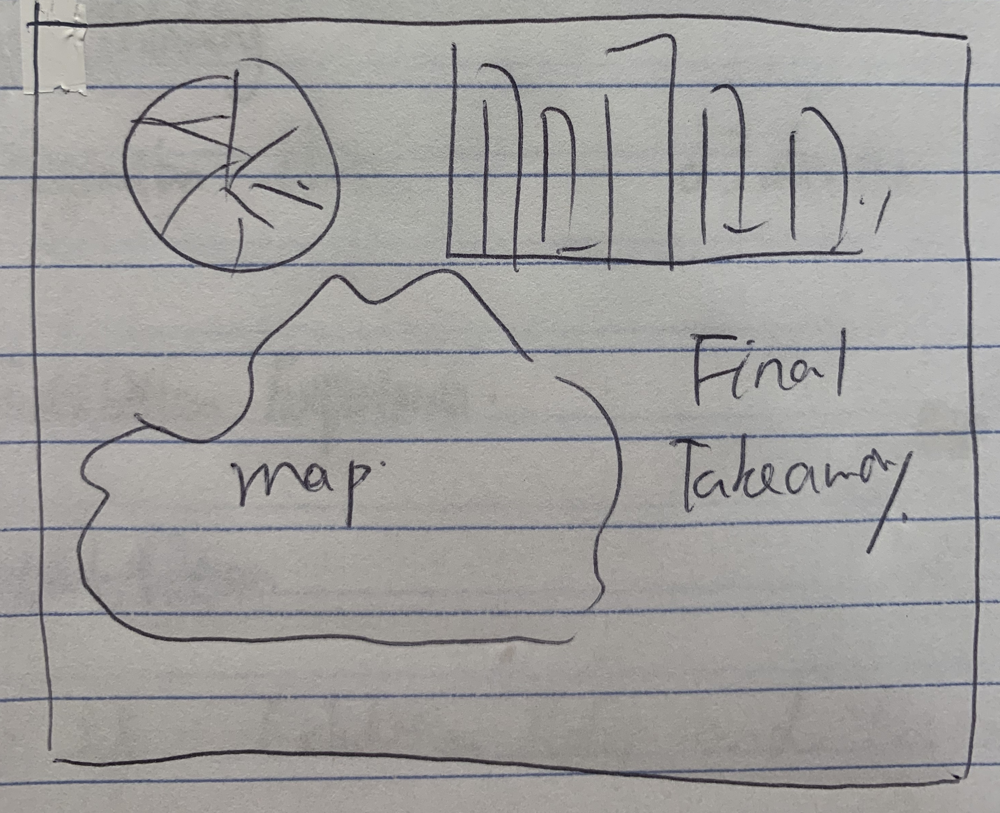

## Part 1

### Outline
#### Quick Summary:
Museum of Modern Art (MoMA), as one of the largest and most influential museums of modern art in the world, it has been play an important role in developing and collecting modern art from 1920s until now. Based on the data of MoMA's collection, my project will be focus on determine the trends between the artwork they collected and the nationality of the artists or artist gender or the type of artwork. Therefore, provide a new and fun way to see the trends in contemporary art history with the data.

#### Project Structure
1. Introduce the background of MoMA, and give people the context about the contemporary art history.
2. Look into the trends between the artwork they collected and the nationality of the artists.
3. Look into the trends between the artwork they collected and the artist's gender.
4. Look into the trends between the artwork they collected and the type of the artwork. 
5. Discuss the trends we see through the data and the relationship with the history of contemporary art, provide some key takeaways on how to understand the contemporary art throught our findings.

### Initial sketches
1. Brief Intro
Introduction to the MoMA and the timeline of contemporary art

2.  MoMA have been collecting more and more artworks from American artists which demonstrate the world center of art shift from Europe to America.

3.  What will be seen is that art history has been dominated by male artists. There are more female artist going to the front of stage since 1960s, which is also the start of civil right movement.

4.  The collction is having more and more diversity in types of artwork, which show contemporary art is more and more open to all kinds of artwork and always challenge people's opinion about what is art. 

5. Final key takeaways about what the trends in contemporary art history.

### Data 
I found the collection data from MoMA's github page, which documenting their collecting records from 1920s until now with more than 26,000 objects in total. To deal with the huge dataset, I will clean the data before I using them to generate data visualization. To analyze their collecting trends, I will focus on factors as nationality, gender and type of art to see the change in the numbers of the artworks in the whole time period. Meanwhile, I will compare the trends with the trends in social-ecomoic changes to understand the contemporary art history.
The data source is from MoMA's github page https://github.com/MuseumofModernArt/collection

###  Method and medium
In the final presentation, I will choose to use Shorthand. The storyboard platform is pretty cool, which is more functional than powerproint. With only 1 minutes to present, I think Shorthand will be a idea tool to use. 
After making sketch with hand drawing and rough data visualization made with Tableau, I will more focus on refining my hypothesis and doing research on how to interpret the trends. Due to the huge body of the dataset I will be work with, there will be a lot work in cleaning the data and organize the data for generating informative and effective charts and conveying the information more clearly.

## Part 2

## Wireframe
To illustrate my analysis of difference between modern art and contemporary art, I will do data visualizations for two different time phase - 1900s-1960s and 1960s-now. By comparing the artworks in modern art period and contemporart art peirod in different perspective, we will finally get an understanding about what's contemporary art from the collection and exhibition history of MoMA.
1. Comparison on the nationality of artists (treemap)

2. Comparison on the gender of artists (area chart)

3. Comparison on the types of artworks (Alluvial diagram)

4. Comparison on the most influencial artist (Heatmap)

##  Storyboard

## User research protocols
1. Target audience: My target audience are the students in our class, who are from different programs of Heinz College. Most of them are from MISM and PPM who may not have much experience and background in art history, and they may have some difficulty to understand the contemporary art. From my presentation, I hope to let everyone in the classroom to have a basic understanding about contemporary art, which could encourage them to go to the museum to see art and care the artworks today.

2. Approach to identifying representative individuals to interview: From the perspective of education background, I will interview three indivisual from MISM, MAM and PPM, which nearly represents all the students in our class. From the perspective of gender, I will interview 2 women and 1 man to represent the gender distrubution (I feel like it is 1:1 in men and women with maybe a little bit more women?). From the perspective of their knowledge background about art, the three interviewees have different scale of knowldge about art.

3. Interview script

a. Can you tell me more about your education backgroud and your knowldge about art especially about contemporary art?

b. How often do you go to see art exhibitions?

c. When looking at this graphic, what is the first thing you see?

d. If the graph give you clear information about the difference between modern art and contemporary art, would it be helpful?

e. In one word, how would you describe this chart?

f. Does the story give you more knowledge about contemporary art and make it more understandable?

4. Findings
The first interviewee is from MAM program with undergraduate background in art history. She finds the topic is interesting and the story is clear and easy to understand. In the end the presentation also provided some new information about the perspective of gender to her. She is satified with the content and most of charts but she gave me some recommendtaion on the area chart for gender. She mentioned that if the area for women is below the area for men, the chart will make more sense to her. And because my handdrawing heat map is too rough, there is some difficulty to understand it without more explaination.

The second interviewee has a background in enegeering but nearly not background in arts or data visualization. The story is clear and informative to him but he pointed out several place making him confuseing. Because he has never seen a Alluvial diagram, it is hard to him understand the chart. He also recommend me to sort the heatmap in a order to put the artist with showing the most in the exhibitions to be the first one, which is clearer to him.

The third interviewee is from MISM-BIDA, with strong background in data analytics and experience in data visualization. I receive several valuable feedbacks from her. Firstly, she pointed out the biggest mistake I made that is the charts don't have titles, which I totally forgot and so important. Secondly, she recommend me to make only one chart for gender distribution with drawing a line to divide the seperate two phases. Thirdly, she enables me to understand why my alluvia diagram is confusing, that is because the flows doesn't have a specific meaning or present a definte relationship. Forthly, she also recommend to use world cloud to replace the heat map, which may be more visual appealing.

5. Changes

a. Area Chart for Gender Distribution

b. Use bubble chart instead of alluvial diagram
Art Type Distribution in 1920s-1960s

Art Type Distribution in 1960s-2010s

c. Use world cloud instead of heatmap
The most influencial artist in 1920s-1960s

The most influencial artist in 1960s-2020s

##Part 3

Audience: My target audience are students in our class. Although they have different background in different industry, they are all people who are educated, have curiosity toward knowledge and care about social issue. In order to engage these people who have various knowledge level about art, I hope to make the complex concept about art history easy and clear to them through the tool of data visualization. 
With my target audience in mind, I chose to only present three findings about the difference between modern art and contemporary art to keep my argument clean and neat, which can allow the audience understand in 1 min. During the process of doing user research, I did the interviews with 3 students from different program. I was really happy that the content of the presentation was interesting to all of them and they all learned something new. But in the final presentation, due to the limitation of time, I had to get rid of some explaination about the background of the changes in the two art phases, which is kind of pity for me no to be able to articulate the whole story.

Summary: The start point of my project is data which I found it on Kaggle. I was really surprised that such kind of collection data is actually open source. The difference between modern art and contemporart art had been alwasy confusing for me, although I have sort of background in art history. Therefore, I think it could be a topic for my project, which also alllow me to dig out the answer. When looking into the data, I had serveral idea I wanted to do, like what kinds of topic is most popular among the two art phases, and how many artworks were purchased by MoMA and what are they, but my data skills are too limited to help me realize the ideas. Therefore, I chose to focus on characteristics that I could analyze, and they narrowed down to artist nationality, medium and gender. However, the dataset is huge, and there are some uncompleted information or ununified inputs, which caused the major difficulty for me to use them. Thanks to my roomate from MISM, she helped me to clean some data with Python, and that allowed me to use Tableau to analyze them.  Another difficulty I met was rethinking about the storyline and call to action. After receiving the feedback from my classmates last class, I realized that there was no clear call to action, and my narrative was just telling information but not enough storytelling. Therefore, I spent a lot time to do the research and plotted the storyline. Luckily, I read about a new survey based on data about how little progress the art museum made in last ten year in acquiring more artworks by female artists, which gave me the inspiration to make the story go to emphasizing the gender disparity issue in art world. After all, I, myselft, learned about through this project. I read a lot article and found this new way to learn about art, which is more compelling than any other approach to know the history. I found so much fun there. Also I realize how important it is to have data analytic skill to deal with data in real life, and I am considering to take a Python class next semster.

## [The link to my final presentation on Shorthand](https://carnegiemellon.shorthandstories.com/yaojiangMoMA/index.html)
